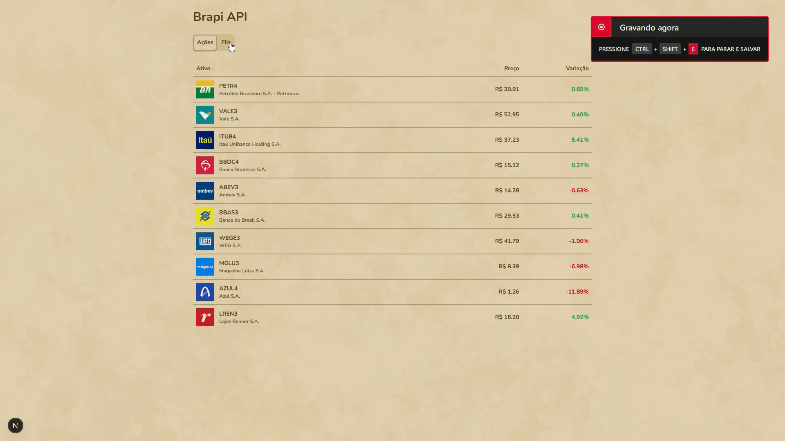

# Brapi API

Projeto criado para exibir cotações de **ações** e **fundos imobiliários (FIIs)** em tempo real, utilizando a API gratuita da [brapi.dev](https://brapi.dev).

---



## 📦 Instalação

```bash
git clone https://github.com/dregoncalves/brapi-app.git
cd brapi-app

npm install
```

---

## ⚙️ Configuração

1. Se não existir, crie um arquivo `.env.local` na raiz do projeto:

```
BRAPI_TOKEN=seu_token_aqui
```

> Você pode obter seu token gratuito em [https://brapi.dev/dashboard](https://brapi.dev/dashboard)

---

## ▶️ Como rodar

```bash
npm run dev
```

Abra no navegador:
`http://localhost:3000`

---
